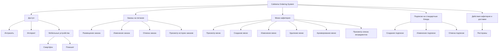

# Документ о концепции и границах проекта

**Система:** Cafeteria Ordering System  
**Организация:** Process Impact  
**Источник:** Карл Вигерс, приложение «Документ о концепции и границах проекта» (кафетерий)  
**Назначение файла:** эталон содержания и глубины проработки для лабораторной работы 1. Структура приведена к обязательным разделам задания; идентификаторы и формулировки сохранены по оригиналу.

| Поле | Значение |
|------|----------|
| Версия | `1.0-example` |
| Статус | эталон (не рабочий документ команды) |

> [!NOTE]
> Не все варианты использования в оригинале расписаны одинаково подробно. UC-1 приведен полностью; UC-5 — средне; UC-9 — сжато. Так и нужно поступать в студенческом документе: детализировать то, чего разработчикам еще неоткуда взять.

## 1. Введение

Для сотрудников, желающих заказывать еду в кафетерии компании или в местных ресторанах через Интернет, **Cafeteria Ordering System** — это интернет-приложение или приложение для смартфона, которое принимает индивидуальные или групповые заявки на питание, взимает оплату и инициирует доставку готовых блюд к указанному пункту на территории Process Impact.

В отличие от имеющихся служб заказа по телефону и вручную, сотрудникам, использующим систему, не придется приходить в кафетерий, чтобы получать заказанные блюда. Это экономит время и увеличивает ассортимент доступных блюд.

## 2. Бизнес-контекст и цели

### 2.1. Исходные данные

Большинство сотрудников Process Impact в настоящее время тратят в среднем **65 минут в день**, чтобы выбрать, оплатить и съесть обед в кафетерии. Около **20 минут** уходит на то, чтобы дойти до кафетерия и вернуться на рабочее место, выбрать еду и оплатить ее наличными или с помощью кредитной карты. Таким образом, сотрудники проводят около **90 минут** вне рабочих мест.

Некоторые звонят в кафетерий заранее, чтобы блюда были готовы к их приходу. Они не всегда получают то, что заказали, потому что некоторые блюда заканчиваются до их прихода. Кафетерий впустую расходует значительный объем продуктов, которые не реализуются, и их приходится выбрасывать. Те же проблемы возникают утром и вечером, хотя гораздо меньше сотрудников завтракает и ужинает, чем обедает.

### 2.2. Возможности бизнеса

Многие сотрудники попросили создать систему, которая позволила бы посетителям кафетерия делать заказ (определенный как набор из одного или большего числа блюд из меню) по сети, чтобы его можно было забрать или заказать доставку в назначенное место в офисе компании в указанный день и указанное время.

Подобная система сэкономит значительное время и позволит получать те блюда, которые хотят клиенты. Это улучшит как качество рабочей среды, так и производительность труда. Кроме того, предоставленные заранее сведения о том, какие блюда хотят получить клиенты, позволит уменьшить потери и увеличит эффективность работы персонала кафетерия.

Если сотрудники получат в будущем возможность заказывать доставку блюд из близлежащих ресторанов, то у них появится больший выбор при меньшей цене, так как фирма сможет заключать оптовые соглашения с ресторанами.

### 2.3. Бизнес-цели

#### BO-1. Уменьшить потери продуктов в кафетерии на 40% в течение 6 месяцев после первого выпуска системы

Пример точной формулировки бизнес-цели (Planguage):

| Параметр | Значение |
|----------|----------|
| Масштабы | стоимость продуктов, выбрасываемых каждую неделю персоналом кафетерия |
| Способ измерения | исследование системы учета запасов кафетерия |
| Показатели в прошлом | 30% (2013 г., первоначальное исследование) |
| Планируемые показатели | менее 20% |
| Обязательные показатели | менее 20% |

- **BO-2.** Снизить эксплуатационные расходы кафетерия на 15% в течение 12 месяцев после первого выпуска системы.
- **BO-3.** Увеличить среднее эффективное рабочее время каждого сотрудника на 15 минут в день в течение 6 месяцев после первого выпуска системы.

### 2.4. Видение решения

См. раздел [1. Введение](#1-введение): система принимает заказы через интрасеть, Интернет или мобильное приложение, проводит оплату и организует получение в кафетерии либо доставку на территорию компании.

## 3. Стейкхолдеры

### 3.1. Профили заинтересованных лиц

| Заинтересованное лицо | Основная ценность | Отношение | Основные интересы | Ограничения |
|-----------------------|-------------------|-----------|-------------------|-------------|
| Руководство компании | Увеличение производительности труда сотрудников; сокращение затрат в кафетерии | Сильная поддержка вплоть до выпуска 2; поддержка выпуска 3 — в зависимости от результатов предыдущих выпусков | Экономия расходов должна превысить затраты на разработку и использование | Не определены |
| Сотрудники кафетерия | Более эффективное использование рабочего времени в течение дня; большее удовлетворение клиентов | Озабоченность взаимоотношениями с профсоюзом и возможным сокращением персонала; в остальном воспринимается нормально | Сохранение рабочих мест | Необходимость обучения работе с Интернетом; потребность в персонале и транспорте для доставки |
| Постоянные клиенты кафетерия | Лучший выбор блюд; экономия времени; удобство | Большой энтузиазм, но могут использовать систему меньше, чем ожидается, из-за социальной значимости обедов в кафетерии и ресторанах | Простота использования; надежность доставки; возможность выбора блюд | Необходимость доступа к корпоративной интрасети, к Интернету или мобильного устройства |
| Отдел расчета зарплаты | Отсутствие прямой выгоды; необходимость создать схему удержания стоимости заказов из зарплаты | Не особо счастливы относительно предстоящей работы над ПО, но понимают ценность для компании и сотрудников | Минимум изменений в текущих приложениях расчета зарплаты | Еще не выделено никаких ресурсов на изменение ПО |
| Менеджеры ресторанов | Увеличение продаж; выход на новые области рынка для привлечения новых клиентов | Поддерживают, но с осторожностью | Минимум новых технологий; озабоченность ресурсами и затратами, необходимыми для доставки блюд | Могут не иметь персонала и возможностей для обработки нужных объемов заказов; не у всех меню представлены в Интернете |

### 3.2. Матрица влияния / интереса

| Стейкхолдер | Влияние | Интерес | Стратегия работы |
|-------------|---------|---------|------------------|
| Руководство компании | высокое | высокое | управлять тесно: согласование границ выпусков и ROI |
| Сотрудники кафетерия | высокое | среднее | вовлекать: обучение, обсуждение графика и профсоюзных рисков |
| Постоянные клиенты | среднее | высокое | информировать и обучать; следить за фактическим adoption |
| Отдел расчета зарплаты | высокое | низкий | удовлетворять минимум изменений; заранее выделять ресурс на интеграцию |
| Менеджеры ресторанов | среднее | среднее | держать в курсе; не включать в выпуск 1 |

## 4. Функциональные требования

### 4.1. Основные функции

| ID | Функция |
|----|---------|
| FE-1 | Заказ и оплата блюд из меню кафетерия для получения в кафетерии или с доставкой |
| FE-2 | Заказ и оплата блюд с доставкой из близлежащих ресторанов |
| FE-3 | Создание, просмотр, изменение и удаление одинарной или регулярной заявки на питание или на ежедневные специальные блюда |
| FE-4 | Создание, просмотр, изменение и удаление меню кафетерия |
| FE-5 | Просмотр списка ингредиентов и сведений о питательности блюд в меню кафетерия |
| FE-6 | Обеспечение доступа к системе через корпоративную интрасеть, смартфон, планшет или через внешнее подключение к Интернету для авторизованных сотрудников |

### 4.2. Дерево функций

### 4.3. Варианты использования по ролям

| Основное действующее лицо | Варианты использования |
| :--- | :--- |
| Пациент | Авторизация по СНИЛС и дате рождения Просмотр расписания и свободных слотов Запись на очный прием к врачу Запись на онлайн-консультацию (ТМК) Запись родственника или подопечного Просмотр активных записей Отмена записи к врачу Получение уведомлений и результатов в чате |
| Врач | Проведение онлайн-консультации (ТМК) Удаленное закрытие больничного листа Просмотр классического расписания приемов |
| Ответственный сотрудник регионального органа здравоохранения | Назначение ответственного за Сервис СП Запрос интеграционных параметров и токенов Управление ключами доступа и авторизации Мониторинг показателей инцидента № 16 Направление обращений в техподдержку |

### 4.4. UC-1. Заказ блюд

Детальная спецификация — образец того, как описывать ключевой сценарий.

| Поле | Значение |
|------|----------|
| Идентификатор и название | UC-1. Заказ блюд |
| Автор | Притхви Радж |
| Дата создания | 04.10.2013 |
| Основное действующее лицо | Клиент |
| Дополнительные действующие лица | Система Cafeteria Ordering System |
| Описание | Клиент обращается в Cafeteria Ordering System из корпоративной интрасети или через Интернет, просматривает меню на определенную дату, выбирает блюда и делает заказ на получение блюд в кафетерии или доставку в определенный пункт в пределах определенного 15-минутного промежутка времени |
| Условие-триггер | Клиент выражает намерение заказать блюдо |
| Предварительные условия | PRE-1. Клиент вошел в систему Cafeteria Ordering System. PRE-2. Клиент зарегистрировался для оплаты посредством удержания из зарплаты |
| Выходные условия | POST-1. Заказ на доставку блюд сохранен в системе со состоянием «Принят». POST-2. Список доступных блюд обновлен с учетом элементов этого заказа. POST-3. Остающиеся резервы возможности доставки в указанный интервал времени обновлены с учетом этого заказа |
| Приоритет | Высокий |
| Частота использования | Приблизительно 300 пользователей, в среднем по одному обращению в день. Пиковая нагрузка — с 9:00 до 10:00 местного времени |
| Бизнес-правила | BR-1, BR-2, BR-3, BR-4, BR-11, BR-12, BR-33 |

#### Нормальное направление 1.0. Заказ одного набора блюд

1. Клиент запрашивает просмотр меню за указанную дату (см. 1.0.E1, 1.0.E2).
2. Cafeteria Ordering System отображает меню доступных блюд и ежедневных специальных блюд.
3. Клиент выбирает одно или более блюд из меню (см. 1.1).
4. Клиент указывает, что заказ блюд завершен (см. 1.2).
5. Cafeteria Ordering System отображает заказанные блюда из меню, стоимость каждого из них и общую сумму, включая все налоги и стоимость доставки.
6. Клиент подтверждает заказ блюд (продолжение нормального направления) или делает запрос на изменение заказа (обратно к п. 2).
7. Система выводит доступные периоды времени доставки на дату доставки.
8. Клиент выбирает время доставки и указывает пункт доставки.
9. Клиент указывает метод оплаты.
10. Система подтверждает, что заказ принят.
11. Система отправляет клиенту сообщение электронной почты с подтверждением деталей заказа, цены и указаниями по доставке.
12. Система сохраняет заказ в базе данных, посылает информацию о заказанных блюдах в систему учета запасов кафетерия и обновляет доступные периоды времени доставки.

#### Альтернативные направления

**1.1. Заказ нескольких идентичных блюд**

1. Клиент делает запрос на заказ определенного числа идентичных блюд (см. 1.1.E1).
2. Возврат к п. 4 нормального направления.

**1.2. Заказ нескольких блюд**

1. Клиент заказывает еще одно блюдо.
2. Возврат к п. 1 нормального направления.

#### Исключения

**1.0.E1. Текущее время — после истечения крайнего срока заказов**

1. Система извещает клиента, что уже слишком поздно делать заказ на сегодня.
2. (a) Если клиент отменяет ввод заказа, система завершает вариант использования.  
   (б) В противном случае клиент запрашивает другую дату, и система начинает вариант использования сначала.

**1.0.E2. Не осталось резервов времени доставки**

1. Система сообщает клиенту, что нет незанятого времени доставки на выбранное число.
2. (a) Если клиент отменяет ввод заказа, система завершает вариант использования.  
   (б) В противном случае клиент делает запрос, чтобы самому получить заказ в кафетерии, и продолжается нормальное направление с пропуском пунктов 7 и 8.

**1.1.E1. Невозможно выполнить заказ на указанное количество одинаковых блюд**

1. Система извещает клиента о максимальном числе одинаковых блюд, заказ на которое она способна принять.
2. (a) Клиент изменяет количество, и управление возвращается к п. 4 нормального направления.  
   (б) В противном случае клиент отменяет ввод заказа, а система завершает вариант использования.

#### Другая информация

1. Клиент должен иметь возможность отменить заказ в любой момент времени до подтверждения заказа.
2. Клиент должен иметь возможность просматривать все заказы за последние шесть месяцев и повторить один из них в качестве нового заказа при условии, что все его пункты присутствуют в меню на указанную дату доставки (приоритет — средний). Это также можно показать как альтернативное направление данного варианта использования.
3. По умолчанию используется текущая дата при условии, что клиент использует систему до истечения крайнего срока заказов.

#### Предположения

Предполагается, что 15% клиентов будут заказывать спецпредложение дня (источник: данные кафетерия за предыдущие шесть месяцев).

### 4.5. UC-5. Регистрация на оплату через удержание из зарплаты

Средняя детализация: разработчикам уже частично известен смежный процесс расчета зарплаты.

| Поле | Значение |
|------|----------|
| Идентификатор и название | UC-5. Регистрация на оплату через удержание из зарплаты |
| Автор | Ненси Андерсон |
| Дата создания | 15.09.2013 |
| Основное действующее лицо | Клиент |
| Дополнительные действующие лица | Система расчета зарплаты |
| Описание | Клиенты кафетерия, использующие Cafeteria Ordering System и заказывающие блюда с доставкой, должны быть зарегистрированы для оплаты посредством удержания из зарплаты. Для безналичных покупок кафетерий будет выставлять счета в системе расчета зарплат, которая будет удерживать стоимость заказов из суммы, которую клиент должен получить в следующий раз прямым зачислением в депозит в день зарплаты |
| Условие-триггер | Клиент запросил регистрацию для оплаты посредством удержания из зарплаты или согласился на регистрацию, когда его об этом спросила Cafeteria Ordering System |
| Предварительные условия | PRE-1. Клиент вошел в систему Cafeteria Ordering System |
| Выходные условия | POST-1. Клиент зарегистрирован для оплаты посредством удержания из зарплаты |
| Приоритет | Высокий |
| Бизнес-правила | BR-86 и BR-88 управляют правом клиента на оплату посредством удержания из зарплаты |

#### Нормальное направление 5.0

1. Клиент запрашивает в системе расчета зарплаты информацию, может ли он зарегистрироваться для удержания из зарплаты.
2. Система расчета зарплат подтверждает, что клиенту предоставлено это право.
3. Система просит клиента подтвердить желание зарегистрироваться.
4. В случае положительного ответа Cafeteria Ordering System отправляет запрос системе расчета зарплат на включение оплаты посредством удержания из зарплаты для клиента.
5. Система расчета зарплат подтверждает, что оплата посредством удержания из зарплаты включена.
6. Cafeteria Ordering System уведомляет клиента, что оплата посредством удержания из зарплаты включена.

Альтернативные направления: нет.

#### Исключения

- **5.0.E1.** Клиент не имеет права на оплату посредством удержания из зарплаты.
- **5.0.E2.** Клиент уже зарегистрирован для оплаты посредством удержания из зарплаты.

#### Другая информация

Нужно ожидать высокой частоты исполнения этого варианта использования в первые две недели после выпуска системы.

### 4.6. UC-9. Изменение меню

Сжатое описание: ключевая информация уже ясна из контекста меню.

| Поле | Значение |
|------|----------|
| Идентификатор и название | UC-9. Изменение меню |
| Автор | Марк Хассалл |
| Дата создания | 07.10.2013 |
| Описание | Менеджер меню кафетерия должен иметь возможность открывать меню на определенную дату в будущем, чтобы добавить новые или удалить или изменить уже имеющиеся в меню блюда, создать и изменить специальные блюда или скорректировать цены, а затем сохранить измененное меню |
| Исключения | Нет меню на выбранную дату: отобразить сообщение об ошибке и дать менеджеру меню возможность ввести новую дату |
| Приоритет | Высокий |
| Бизнес-правила | BR-24 |

**Другая информация.** Некоторые блюда не пригодны для доставки, и поэтому меню для клиентов Cafeteria Ordering System, заказывающих блюда с доставкой, не всегда в точности соответствует меню в кафетерии. У менеджера меню должна быть возможность отметить такие блюда как непригодные для доставки.

## 5. Нефункциональные требования

Сформулированы по ограничениям, приоритетам и сценариям оригинального документа (отдельного раздела NFR у Вигерса в приложении нет — в студенческой работе его нужно выделять явно).

| ID | Категория | Требование | Метрика / порог |
|----|-----------|------------|-----------------|
| NFR-P1 | Производительность | Доставка укладывается в окно относительно указанного клиентом времени | не более 15 минут (AS-2) |
| NFR-P2 | Производительность | Система выдерживает пик заказов обеда | ~300 пользователей, в среднем 1 обращение/день; пик 9:00–10:00 |
| NFR-A1 | Доступность | Авторизованные сотрудники работают с системы из интрасети и через внешний Интернет уже в выпуске 1 | каналы FE-6 / выпуск 1 |
| NFR-S1 | Безопасность | Все тесты на защищенность выполнены до приемки выпуска | 100% security-тестов (раздел приоритетов) |
| NFR-S2 | Безопасность | Доступ только для авторизованных сотрудников | вход в систему как предусловие UC |
| NFR-C1 | Совместимость | Интеграция с системой расчета зарплаты | UC-5, удержание из зарплаты в выпуске 1 |
| NFR-C2 | Совместимость | Двусторонняя связь с собственной системой заказов ресторана, если она есть | DE-1 |
| NFR-C3 | Совместимость | Обмен с системой учета запасов кафетерия | шаг 12 UC-1 |
| NFR-Q1 | Качество | Пользовательские проверочные тесты пройдены | не менее 95% |
| NFR-U1 | Обучение | Короткие видеоролики по веб-версии и мобильным приложениям | не более 5 минут каждый |
| NFR-D1 | Развертывание | ПО веб-сервера обновлено до последней версии к готовности соответствующего выпуска | выпуск 1 — веб; выпуск 2 — iOS/Android; выпуск 3 — Windows Phone |

## 6. Границы кейса

### 6.1. In Scope

- Заказ и оплата блюд кафетерия (получение на месте или доставка) — FE-1.
- Создание и просмотр меню — FE-4 (часть функций).
- Доступ через интрасеть и Интернет — часть FE-6.
- Оплата выпуска 1 — только удержанием из зарплаты.
- Только стандартные функции меню обедов в выпуске 1.

### 6.2. Out of Scope

- **LI-1.** На некоторые пункты меню кафетерия доставка не распространяется, поэтому блюда, доступные клиентам Cafeteria Ordering System, будут подмножеством полных меню кафетерия.
- **LI-2.** Cafeteria Ordering System применяется только для кафетерия главного офиса Process Impact в г. Клакамас, штат Орегон.
- Заказы из ресторанов (FE-2) — не в выпуске 1.
- Подписки на стандартные блюда (FE-3) — не в выпуске 1.
- Список ингредиентов (FE-5) — не в выпуске 1.
- Нативные приложения для смартфонов и планшетов — не в выпуске 1.
- Оплата кредитной или дебетовой картой — не в выпуске 1.
- Заказы на завтрак и ужин — не в выпуске 1.

> [!WARNING]
> Явный Out of Scope защищает от *scope creep*: запросы «а давайте сразу рестораны и карты» выносятся в выпуски 2–3, а не в текущий кейс.

### 6.3. Состав первого и последующих выпусков

| Функция | Выпуск 1 | Выпуск 2 | Выпуск 3 |
|---------|----------|----------|----------|
| FE-1. Заказ в кафетерии | Только стандартные функции из меню обедов; оплата заказов производится только посредством удержания из зарплаты | Прием платежа кредитной или дебетовой картой | Прием заказов на завтрак и ужин |
| FE-2. Заказы из ресторанов | Не реализована | Блюда доставляются только на территории компании | Реализована полностью |
| FE-3. Подписки на стандартные блюда | Не реализована | Реализация, если позволит время | Реализована полностью |
| FE-4. Меню | Создание и просмотр меню | Модификация, удаление и архивирование меню | — |
| FE-5. Список ингредиентов | Не реализована | Реализована полностью | — |
| FE-6. Доступ к системе | Интрасеть и доступ через Интернет извне | Приложения для телефонов и планшетов с iOS и Android | Приложения для телефонов и планшетов с Windows Phone |

## 7. Ограничения и допущения

### 7.1. Ограничения и исключения

См. LI-1 и LI-2 в [Out of Scope](#62-out-of-scope).

### 7.2. Предположения и зависимости

| ID | Тип | Формулировка |
|----|-----|--------------|
| AS-1 | допущение | У работников кафетерия будут системы с соответствующими интерфейсами для обработки ожидаемого числа заказываемых блюд |
| AS-2 | допущение | Число работников кафетерия и автомобилей будет таким, что все блюда будут доставляться в течение 15 минут в рамках указанного времени |
| DE-1 | зависимость | Если в ресторане есть собственная система заказов, Cafeteria Ordering System должна поддерживать двустороннюю связь с ней |

### 7.3. Приоритеты проекта

| Область | Ограничения | Движущая сила | Степень свободы |
|---------|-------------|---------------|-----------------|
| Функции | Все функции, запланированные на выпуск 1.0, должны быть полностью реализованы | | |
| Качество | 95% пользовательских проверочных тестов должны быть выполнены; все тесты на защищенность должны быть выполнены | | |
| Сроки | | | По плану выпуск 1 должен быть доступен к концу I квартала следующего года, выпуск 2 — к концу II квартала; допустима задержка до 2 недель без пересмотра сроков куратором проекта |
| Расходы | | | До 15% перерасхода по бюджету возможны без пересмотра куратором проекта |
| Персонал | | | Планируемый состав команды: работающий на полставки менеджер проекта, 2 разработчика, тестировщик, работающий на полставки; при необходимости могут быть дополнительно привлечены разработчик и тестировщик, работающие на полставки |

### 7.4. Особенности развертывания

ПО веб-сервера нужно обновить до последней версии. В рамках второго выпуска нужно разработать приложения для смартфонов и планшетов под управлением iOS и Android, а в третьем выпуске — приложения для смартфонов и планшетов с Windows Phone. К моменту готовности второго выпуска все соответствующие изменения должны быть выполнены.

Нужно разработать видеоролики длительностью не более пяти минут, обучающие пользователей работе с интернет-версией и приложениями системы Cafeteria Ordering System.

## 8. Риски

| ID | Риск | Вероятность | Ущерб | Митигация |
|----|------|-------------|-------|-----------|
| RI-1 | Профсоюз работников кафетериев может потребовать пересмотра контрактов сотрудников кафетерия, чтобы они отражали новое распределение обязанностей и график работы кафетерия | 0,6 | 3 | Заранее согласовать изменения обязанностей с руководством кафетерия и профсоюзом; не закладывать сокращение штата в цели выпуска 1 |
| RI-2 | Слишком мало сотрудников могут сразу принять новую систему, что уменьшит прибыль от инвестиций в разработку системы и изменений в схеме работы кафетерия | 0,3 | 9 | Обучение (NFR-U1), сохранение привычного получения заказа в кафетерии, критерий adoption SM-1 |
| RI-3 | Близлежащие рестораны могут не согласиться предоставить скидки, что уменьшит удовлетворенность сотрудников системой и, возможно, ее использование | 0,3 | 3 | Рестораны вынесены из выпуска 1; пилот с 1–2 площадками во выпуске 2 |
| RI-4 | Имеющихся возможностей может оказаться недостаточно, из-за чего сотрудники смогут не всегда получать свои заказы и заказывать доставку на нужное время | 0,5 | 6 | Лимиты слотов доставки в UC-1 (исключение 1.0.E2); допущение AS-2 проверить до запуска |

> [!WARNING]
> Наибольший ущерб у RI-2 (adoption). Критерии успеха SM-1 и SM-2 как раз проверяют, что сотрудники начали пользоваться системой, а не только что она «работает».

## 9. Критерии приемки

| ID | Критерий | Как проверяется | Порог | Срок |
|----|----------|-----------------|-------|------|
| SM-1 | Сотрудники, которые пользовались кафетерием как минимум три раза в неделю в третьем квартале 2013 года, начинают использовать Cafeteria Ordering System | Журнал заказов / учет посещений | не менее 75% таких сотрудников используют систему минимум раз в неделю | в течение 6 месяцев после первого выпуска |
| SM-2 | Рост среднего рейтинга по ежеквартальному опросу об удовлетворенности работой кафетерия | Опрос по шкале от 1 до 6, сравнение с третьим кварталом 2013 года | +0,5 балла за 3 месяца; +1,0 балла за 12 месяцев после первого выпуска | 3 / 12 месяцев |
| AC-1 | Функции выпуска 1 реализованы полностью | Чек-лист FE-1, FE-4 (создание/просмотр), FE-6 (интрасеть и Интернет) | 100% запланированного scope выпуска 1 | приемка выпуска 1 |
| AC-2 | Качество и безопасность | Пользовательские и security-тесты | ≥ 95% пользовательских тестов; 100% тестов на защищенность | приемка выпуска 1 |
| BO-1…BO-3 | Бизнес-эффект | Запасы кафетерия, эксплуатационные расходы, учет рабочего времени | см. раздел 2.3 | 6 / 12 месяцев после выпуска 1 |

Партнер принимает выпуск 1, если выполнены AC-1 и AC-2. Бизнес-цели BO-* и метрики SM-* подтверждают ценность решения после запуска и используются как KPI сопровождения, а не как блокер технической приемки первого релиза.
