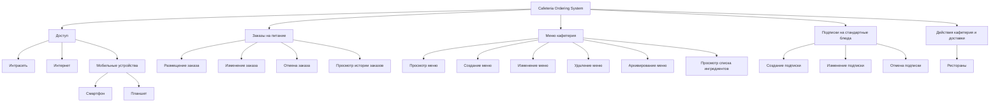

# Документ о концепции и границах проекта

**Система:** Cafeteria Ordering System  
**Организация:** Process Impact  
**Источник:** Карл Вигерс, приложение «Документ о концепции и границах проекта» (кафетерий)  
**Назначение файла:** эталон содержания и глубины проработки для лабораторной работы 1. Структура приведена к обязательным разделам задания; идентификаторы и формулировки сохранены по оригиналу.

| Поле | Значение |
|------|----------|
| Версия | `1.0-example` |
| Статус | эталон (не рабочий документ команды) |

> [!NOTE]
> Не все варианты использования в оригинале расписаны одинаково подробно. UC-1 приведен полностью; UC-5 — средне; UC-9 — сжато. Так и нужно поступать в студенческом документе: детализировать то, чего разработчикам еще неоткуда взять.

## 1. Введение

Для сотрудников, желающих заказывать еду в кафетерии компании или в местных ресторанах через Интернет, **Cafeteria Ordering System** — это интернет-приложение или приложение для смартфона, которое принимает индивидуальные или групповые заявки на питание, взимает оплату и инициирует доставку готовых блюд к указанному пункту на территории Process Impact.

В отличие от имеющихся служб заказа по телефону и вручную, сотрудникам, использующим систему, не придется приходить в кафетерий, чтобы получать заказанные блюда. Это экономит время и увеличивает ассортимент доступных блюд.

## 2. Бизнес-контекст и цели

### 2.1. Исходные данные

Большинство сотрудников Process Impact в настоящее время тратят в среднем **65 минут в день**, чтобы выбрать, оплатить и съесть обед в кафетерии. Около **20 минут** уходит на то, чтобы дойти до кафетерия и вернуться на рабочее место, выбрать еду и оплатить ее наличными или с помощью кредитной карты. Таким образом, сотрудники проводят около **90 минут** вне рабочих мест.

Некоторые звонят в кафетерий заранее, чтобы блюда были готовы к их приходу. Они не всегда получают то, что заказали, потому что некоторые блюда заканчиваются до их прихода. Кафетерий впустую расходует значительный объем продуктов, которые не реализуются, и их приходится выбрасывать. Те же проблемы возникают утром и вечером, хотя гораздо меньше сотрудников завтракает и ужинает, чем обедает.

### 2.2. Возможности бизнеса

Многие сотрудники попросили создать систему, которая позволила бы посетителям кафетерия делать заказ (определенный как набор из одного или большего числа блюд из меню) по сети, чтобы его можно было забрать или заказать доставку в назначенное место в офисе компании в указанный день и указанное время.

Подобная система сэкономит значительное время и позволит получать те блюда, которые хотят клиенты. Это улучшит как качество рабочей среды, так и производительность труда. Кроме того, предоставленные заранее сведения о том, какие блюда хотят получить клиенты, позволит уменьшить потери и увеличит эффективность работы персонала кафетерия.

Если сотрудники получат в будущем возможность заказывать доставку блюд из близлежащих ресторанов, то у них появится больший выбор при меньшей цене, так как фирма сможет заключать оптовые соглашения с ресторанами.

### 2.3. Бизнес-цели

#### BO-1. Уменьшить потери продуктов в кафетерии на 40% в течение 6 месяцев после первого выпуска системы

Пример точной формулировки бизнес-цели (Planguage):

| Параметр | Значение |
|----------|----------|
| Масштабы | стоимость продуктов, выбрасываемых каждую неделю персоналом кафетерия |
| Способ измерения | исследование системы учета запасов кафетерия |
| Показатели в прошлом | 30% (2013 г., первоначальное исследование) |
| Планируемые показатели | менее 20% |
| Обязательные показатели | менее 20% |

- **BO-2.** Снизить эксплуатационные расходы кафетерия на 15% в течение 12 месяцев после первого выпуска системы.
- **BO-3.** Увеличить среднее эффективное рабочее время каждого сотрудника на 15 минут в день в течение 6 месяцев после первого выпуска системы.

### 2.4. Видение решения

См. раздел [1. Введение](#1-введение): система принимает заказы через интрасеть, Интернет или мобильное приложение, проводит оплату и организует получение в кафетерии либо доставку на территорию компании.

## 3. Стейкхолдеры

### 3.1. Профили заинтересованных лиц

| Заинтересованное лицо | Основная ценность | Отношение | Основные интересы | Ограничения |
|-----------------------|-------------------|-----------|-------------------|-------------|
| Руководство компании | Увеличение производительности труда сотрудников; сокращение затрат в кафетерии | Сильная поддержка вплоть до выпуска 2; поддержка выпуска 3 — в зависимости от результатов предыдущих выпусков | Экономия расходов должна превысить затраты на разработку и использование | Не определены |
| Сотрудники кафетерия | Более эффективное использование рабочего времени в течение дня; большее удовлетворение клиентов | Озабоченность взаимоотношениями с профсоюзом и возможным сокращением персонала; в остальном воспринимается нормально | Сохранение рабочих мест | Необходимость обучения работе с Интернетом; потребность в персонале и транспорте для доставки |
| Постоянные клиенты кафетерия | Лучший выбор блюд; экономия времени; удобство | Большой энтузиазм, но могут использовать систему меньше, чем ожидается, из-за социальной значимости обедов в кафетерии и ресторанах | Простота использования; надежность доставки; возможность выбора блюд | Необходимость доступа к корпоративной интрасети, к Интернету или мобильного устройства |
| Отдел расчета зарплаты | Отсутствие прямой выгоды; необходимость создать схему удержания стоимости заказов из зарплаты | Не особо счастливы относительно предстоящей работы над ПО, но понимают ценность для компании и сотрудников | Минимум изменений в текущих приложениях расчета зарплаты | Еще не выделено никаких ресурсов на изменение ПО |
| Менеджеры ресторанов | Увеличение продаж; выход на новые области рынка для привлечения новых клиентов | Поддерживают, но с осторожностью | Минимум новых технологий; озабоченность ресурсами и затратами, необходимыми для доставки блюд | Могут не иметь персонала и возможностей для обработки нужных объемов заказов; не у всех меню представлены в Интернете |

### 3.2. Матрица влияния / интереса

| Стейкхолдер | Влияние | Интерес | Стратегия работы |
|-------------|---------|---------|------------------|
| Руководство компании | высокое | высокое | управлять тесно: согласование границ выпусков и ROI |
| Сотрудники кафетерия | высокое | среднее | вовлекать: обучение, обсуждение графика и профсоюзных рисков |
| Постоянные клиенты | среднее | высокое | информировать и обучать; следить за фактическим adoption |
| Отдел расчета зарплаты | высокое | низкий | удовлетворять минимум изменений; заранее выделять ресурс на интеграцию |
| Менеджеры ресторанов | среднее | среднее | держать в курсе; не включать в выпуск 1 |

## 4. Функциональные требования

### 4.1. Основные функции

| ID | Функция |
|----|---------|
| FE-1 | Заказ и оплата блюд из меню кафетерия для получения в кафетерии или с доставкой |
| FE-2 | Заказ и оплата блюд с доставкой из близлежащих ресторанов |
| FE-3 | Создание, просмотр, изменение и удаление одинарной или регулярной заявки на питание или на ежедневные специальные блюда |
| FE-4 | Создание, просмотр, изменение и удаление меню кафетерия |
| FE-5 | Просмотр списка ингредиентов и сведений о питательности блюд в меню кафетерия |
| FE-6 | Обеспечение доступа к системе через корпоративную интрасеть, смартфон, планшет или через внешнее подключение к Интернету для авторизованных сотрудников |

### 4.2. Дерево функций

### 4.3. Варианты использования по ролям

| Основное действующее лицо | Варианты использования |
| :--- | :--- |
| Пациент | Авторизация по СНИЛС и дате рождения Просмотр расписания и свободных слотов Запись на очный прием к врачу Запись на онлайн-консультацию (ТМК) Запись родственника или подопечного Просмотр активных записей Отмена записи к врачу Получение уведомлений и результатов в чате |
| Врач | Проведение онлайн-консультации (ТМК) Удаленное закрытие больничного листа Просмотр классического расписания приемов |
| Ответственный сотрудник регионального органа здравоохранения | Назначение ответственного за Сервис СП Запрос интеграционных параметров и токенов Управление ключами доступа и авторизации Мониторинг показателей инцидента № 16 Направление обращений в техподдержку |

### 4.4. Детальная спецификация ключевых вариантов использования

#### UC-3. Запись на очный прием к врачу

| Поле | Значение |
|------|----------|
| Идентификатор и название | UC-3. Запись на очный прием к врачу |
| Автор | |
| Дата создания | 09.10.2026 |
| Основное действующее лицо | Пациент |
| Описание | Пациент запускает чат-бот в мессенджере MAX, выбирает нужную медицинскую организацию, специальность, конкретного врача, дату и свободное время приема, после чего получает мгновенный талон-подтверждение записи в чате. |
| Условие-триггер | Пациент выбирает команду «Записаться к врачу» в главном меню чат-бота. |
| Предварительные условия | PRE-1. Пациент имеет подтвержденную учетную запись в мессенджере MAX. PRE-2. Пациент успешно прошел автоматическую авторизацию по СНИЛС (выполнен UC-1). |
| Выходные условия | POST-1. Выбранный временной слот успешно заблокирован и сохранен в расписании МИС БАРС. POST-2. В федеральную систему агрегации Минцифры автоматически отправлено S2S-событие "appointment_open_znp". POST-3. Гражданин получил интерактивную карточку записи прямо в диалоге мессенджера. |
| Приоритет | Высокий |
| Частота использования | Постоянно, высокая интенсивность в утренние часы. |
| Бизнес-правила |  |

#### Нормальное направление 3.0. Оформление талона на очный прием

1. Пациент запрашивает создание новой записи к врачу (см. 3.1).
2. Система извлекает из МИС БАРС и отображает список доступных медицинских организаций, к которым прикреплен гражданин.
3. Пациент выбирает конкретную медицинскую организацию.
4. Система запрашивает и выводит список доступных в этой поликлинике специализаций врачей.
5. Пациент выбирает нужную специальность, после чего система рендерит список ФИО доступных специалистов.
6. Пациент выбирает конкретного врача.
7. Система выводит интерактивный календарь с доступными датами и свободными временными слотами.
8. Пациент выбирает желаемую дату и время (см. 3.0.E1).
9. Система предлагает определить формат визита. Пациент выбирает «Очный визит» (см. 3.2).
10. Система фиксирует бронирование слота в МИС БАРС.
11. Система отправляет серверный REST API запрос с типом события "appointment_open_znp" на шлюз трекера Минцифры России.
12. Система выводит в чат мессенджера MAX карточку-подтверждение записи с указанием даты, времени, кабинета и ФИО врача.

#### Альтернативные направления

**3.1. Запись родственника или подопечного**
1. На шаге 1 пациент указывает, что хочет оформить запись на другого человека.
2. Система запускает процесс переключения контекста на члена семьи (переход к UC-5).
3. Возврат к п. 2 нормального направления с использованием медицинской карты родственника.

**3.2. Выбор дистанционного формата приема**
1. На шаге 9 пациент указывает, что ему необходима онлайн-консультация.
2. Система перенаправляет поток управления на сценарий телемедицины (переход к UC-4).

#### Исключения

**1.0.E1. Конфликт одновременного бронирования слота**
1. В момент подтверждения (шаг 10) выясняется, что выбранное время было занято другим пользователем в МИС секундой ранее.
2. Система извещает пациента, что слот более недоступен для записи.
3. Управление возвращается к п. 7 нормального направления для выбора альтернативного времени.

**1.0.E2. Обнаружение дублирующей активной записи**
1. Перед фиксацией брони (шаг 10) system обнаруживает в МИС БАРС уже существующий действующий талон этого пациента к специалисту того же профиля.
2. Система сообщает, что по правилам отрасли нельзя держать две активные записи к одной специальности одновременно.
3. Система предлагает пациенту отменить старую запись (переход к UC-7), а текущий вариант использования завершается.

#### Другая информация
1. Пользователь должен иметь техническую возможность прервать сценарий и вернуться в главное меню чат-бота на любом шаге до окончательного бронирования талона.
2. По умолчанию при выводе списка врачей система должна ранжировать специалистов по территориальной близости подразделения поликлиники, к которому прикреплен гражданин.

#### UC-1. Авторизация по СНИЛС и дате рождения

| Поле | Значение |
|------|----------|
| Идентификатор и название | UC-1. Авторизация по СНИЛС и дате рождения |
| Автор |  |
| Дата создания | 09.10.2026 |
| Основное действующее лицо | Пациент |
| Описание | Процесс первичного распознавания и верификации личности гражданина при его первом входе в чат-бот мессенджера MAX для предоставления санкционированного доступа к государственным медицинским услугам и персональным данным расписания. |
| Условие-триггер | Пациент впервые отправляет любое текстовое сообщение в чат-бот MAX. |
| Предварительные условия | PRE-1. Гражданин открыл диалоговое окно официаческого чат-бота здравоохранения в MAX. |
| Выходные условия | POST-1. Локальный идентификатор пользователя успешно связан со СНИЛС пациента в системе логирования. POST-2. Гражданину открыт доступ к функционалу записи, просмотра и отмены талонов. |
| Приоритет | Высокий |
| Бизнес-правила |  |

#### Нормальное направление 1.0. Верификация сессии пользователя

1. Пациент активирует чат-бот в мессенджере MAX.
2. Бот считывает входящий user_id мессенджера и проверяет его наличие в локальном кэше авторизованных пользователей (см. 4.1).
3. Бот отправляет приветственное сообщение и просит ввести СНИЛС.
4. Пациент отправляет свой СНИЛС в ответном сообщении.
5. Бот просит ввести дату рождения в формате ДД.ММ.ГГГГ.
6. Пациент вводит дату рождения.
7. Система обращается к центральному реестру пациентов МИС БАРС, передавая СНИЛС и дату рождения.
8. МИС БАРС подтверждает наличие карты и прикрепления, возвращая ФИО гражданина.
9. Система сохраняет постоянную связку user_id мессенджера - СНИЛС в локальную базу данных и выводит главное меню бота с обращением по имени-отчеству.

#### Альтернативные направления

**1.1. Сессия уже существует в системе**
1. На шаге 2 система находит user_id в кэше ранее авторизованных пользователей.
2. Бот пропускает шаги ввода (3-8) и сразу отображает для пациента главное интерактивное меню.

#### Исключения

**1.0.E1. Несовпадение данных или отсутствие прикрепления**
1. На шаге 8 МИС БАРС сообщает, что СНИЛС не зарегистрирован в системе или дата рождения введена неверно.
2. Бот извещает: «Ошибка авторизации. Проверьте правильность ввода данных. Если ошибка повторяется, обратитесь в регистратуру поликлиники».
3. Доступ к меню блокируется, управление возвращается к п. 3 нормального направления.

#### UC-7. Отмена записи к врачу

| Поле | Значение |
|------|----------|
| Идентификатор и название | UC-7. Отмена записи к врачу |
| Автор |  |
| Дата создания | 09.10.2026 |
| Основное действующее лицо | Пациент |
| Описание | Гражданин обращается к чат-боту MAX для аннулирования ранее созданного талона на очный прием или онлайн-ТМК. Это необходимо, чтобы оперативно убрать бронь из расписания поликлиники в МИС БАРС и вернуть освободившийся слот в общий оборот для других пациентов. |
| Условие-триггер | Пациент нажимает кнопку «Отменить запись» на интерактивной карточке приема. |
| Предварительные условия | PRE-1. Пациент авторизован в боте. PRE-2. В МИС БАРС присутствует хотя бы одна активная запись, привязанная к СНИЛС пациента. |
| Выходные условия | POST-1. Бронь слота удалена из расписания поликлиники в МИС БАРС, время доступно для повторной записи. POST-2. Статус талона изменен на «Отменен». POST-3. Пользователь получил текстовое уведомление об успешной отмене в чате MAX. |
| Приоритет | Высокий |
| Бизнес-правила |  |

#### Нормальное направление 2.0. Удаление бронирования из расписания

1. Пациент открывает перечень своих текущих броней (выполняется UC-6).
2. Пациент нажимает кнопку «Отменить запись» под карточкой конкретного талона.
3. Система запрашивает подтверждение операции: «Вы действительно хотите отменить запись к врачу?».
4. Пациент выбирает вариант «Да, отменить» (см. 7.1).
5. Система направляет команду удаления брони в МИС БАРС.
6. МИС БАРС аннулирует талон и мгновенно переводит временной слот в статус свободного для поиска.
7. Чат-бот выводит в диалог мессенджера MAX подтверждение: «Запись успешно отменена. Слот возвращен в расписание».

#### Альтернативные направления

**7.1. Отказ от проведения операции отмены**
1. На шаге 4 пациент нажимает кнопку «Нет, сохранить запись».
2. Система прерывает процесс удаления брони и возвращает пользователя к списку активных талонов (шаг 1 нормального направления).

#### Исключения

**7.0.E1. Нарушение временного лимита отмены**
1. Пациент инициирует отмену на шаге 2, когда до начала приема по талону осталось менее 30 минут (например, 15 минут).
2. Система блокирует выполнение серверного запроса, оставляет слот занятым в МИС БАРС и выводит сообщение: «Автоматическая отмена через чат-бот невозможна (осталось менее 30 минут). Пожалуйста, свяжитесь с регистратурой поликлиники». Вариант использования завершается.

### 4.5. Спецификация основных вариантов использования

#### UC-4. Запись на онлайн-консультацию (ТМК)

| Поле | Значение |
|------|----------|
| Идентификатор и название | UC-4. Запись на онлайн-консультацию (ТМК) |
| Автор |  |
| Дата создания | 09.10.2026 |
| Основное действующее лицо | Пациент |
| Описание | Пациент выбирает дистанционный формат телемедицинской консультации (ТМК) с врачом, бронирует время приема в чат-боте и получает инструкции по совершению звонка внутри национального мессенджера MAX. |
| Условие-триггер | Пациент выбирает пункт «Онлайн-консультация (ТМК)» на этапе определения формата приема. |
| Предварительные условия | PRE-1. Пациент успешно выполнил шаги 1–8 нормального направления базового сценария UC-3. |
| Выходные условия | POST-1. Слот для ТМК зарезервирован в расписании врача в МИС БАРС. POST-2. В трекер Минцифры автоматически отправлен JSON REST-запрос с типом события "appointment_open_tmk". POST-3. Пациент получил в чате памятку и ссылку на будущую видеосессию. |
| Приоритет | Высокий |
| Бизнес-правила | |

##### Нормальное направление 4.0
1. Пациент на шаге 9 сценария UC-3 выбирает пункт «Онлайн-консультация (ТМК)».
2. Система проверяет в МИС БАРС доступность выбранного слота времени именно для дистанционного приема данным специалистом.
3. Система блокирует время в МИС, генерирует внутренний callback-идентификатор для интеграции видеозвонка и переводит статус талона в «ТМК».
4. Система формирует и посылает REST API запрос с типом события "appointment_open_tmk" в агрегирующую систему Минцифры.
5. Система выводит в диалог мессенджера MAX подтверждение записи с инструкцией по выходу на связь в назначенное время.

##### Исключения
* **4.0.E1.** Выбранный врач не осуществляет дистанционный прием или у него острадала лицензия на ТМК в МИС БАРС. Система сообщает об ограничении и возвращает пользователя к шагу 8 сценария UC-3 для выбора очного приема или другого специалиста.

#### UC-5. Запись родственника или подопечного

| Поле | Значение |
|------|----------|
| Идентификатор и название | UC-5. Запись родственника или подопечного |
| Автор | |
| Дата создания | 09.10.2026 |
| Основное действующее лицо | Пациент |
| Описание | Гражданин использует интерфейс чат-бота MAX, чтобы записать на прием члена своей семьи (ребенка, пожилого родственника или недееспособного подопечного). Сценарий обеспечивает переключение контекста поиска и проверок на медицинскую карту другого человека без необходимости создания отдельных аккаунтов. |
| Условие-триггер | Пациент выбирает опцию «Записать родственника» на этапе выбора формы записи в чат-боте. |
| Предварительные условия | PRE-1. Сам пользователь успешно прошел первичную идентификацию по своему СНИЛС (UC-1). |
| Выходные условия | POST-1. Внутренний контекст сессии чат-бота успешно переключен на СНИЛС родственника. POST-2. Данные родственника верифицированы в региональном реестре МИС БАРС. |
| Приоритет | Высокий |
| Бизнес-правила |  |

#### Нормальное направление 5.0
1. Пациент на шаге 4 сценария UC-3 выбирает вариант «Записать родственника».
2. Чат-бот выводит текстовый запрос: «Введите СНИЛС человека, которого вы хотите записать».
3. Пациент вводит номер СНИЛС родственника.
4. Чат-бот запрашивает дату рождения этого родственника.
5. Пациент вводит дату рождения.
6. Система отправляет агрегированный запрос в МИС БАРС для проверки существования пациента и его территориального прикрепления к поликлиникам региона.
7. МИС БАРС подтверждает валидность данных и возвращает ФИО родственника.
8. Чат-бот фиксирует СНИЛС родственника как целевой для текущей сессии, выводит сообщение «Данные верифицированы. Оформление записи для: ФИО родственника» и перенаправляет поток управления на шаг 6 сценария UC-3.

#### Исключения
* **5.0.E1.** На шаге 7 МИС сообщает, что гражданин с такими параметрами не зарегистрирован. Чат-бот выводит ошибку: «Пациент со СНИЛС не найден в базе данных поликлиник области. Проверьте ввод или обратитесь в регистратуру». Сессия сбрасывается в главное меню.

#### UC-6. Просмотр активных записей

| Поле | Значение |
|------|----------|
| Идентификатор и название | UC-6. Просмотр активных записей |
| Автор |  |
| Дата создания | 09.10.2026 |
| Основное действующее лицо | Пациент |
| Описание | Гражданин отправляет запрос в чат-бот для вывода на экран мобильного устройства актуального перечня всех забронированных на его имя талонов к врачам, чтобы уточнить параметры приемов или инициировать отмену. |
| Условие-триггер | Пациент выбирает пункт меню «Мои активные записи» в интерфейсе чат-бота. |
| Предварительные условия | PRE-1. Пациент успешно авторизован в боте (выполнен UC-1). |
| Выходные условия | POST-1. На экран мессенджера MAX выведен структурированный список действующих броней, извлеченных из МИС БАРС в реальном времени. |
| Приоритет | Высокий |
| Бизнес-правила |  |

#### Нормальное направление 6.0
1. Пациент нажимает кнопку «Мои активные записи» в главном меню чат-бота.
2. Система считывает user_id мессенджера, определяет связанный СНИЛС пользователя и СНИЛСы родственников, которых он записывал ранее.
3. Система формирует запрос в МИС БАРС на поиск всех активных талонов со статусом «Занят» для пула извлеченных СНИЛС.
4. МИС БАРС возвращает структурированный массив данных (дата, время, ФИО врача, специальность, название клиники, адрес подразделения, тип приема) для каждой найденной записи.
5. Чат-бот последовательно генерирует и выводит в диалоговое окно мессенджера интерактивные карточки приемов.
6. Под каждой карточкой система размещает функциональную кнопку «Отменить запись» (переход к UC-).

#### Исключения
* **6.0.E1.** На шаге 4 МИС БАРС возвращает пустой массив (записи отсутствуют). Чат-бот выводит текстовый ответ: «У вас нет активных записей к врачам на ближайшее время» и отображает кнопку возврата в главное меню. Вариант использования завершается.

#### UC-8. Проведение онлайн-консультации (ТМК)

| Поле | Значение |
|------|----------|
| Идентификатор и название | UC-8. Проведение онлайн-консультации (ТМК) |
| Автор |  |
| Дата создания | 09.10.2026 |
| Основное действующее лицо | Врач |
| Описание | Медицинский специалист осуществляет дистанционный прием пациента посредством видеозвонка через платформу мессенджера MAX, используя при этом свое стандартное автоматизированное рабочее место (АРМ) в МИС БАРС, после чего фиксирует итоги осмотра. |
| Условие-триггер | Наступление планового времени приема по талону со статусом «Онлайн-ТМК» в электронном журнале врача. |
| Предварительные условия | PRE-1. Пациент предварительно записан на ТМК на данный временной слот (выполнен UC-3). PRE-2. Врач авторизован в АРМ МИС БАРС и имеет доступ к модулю телемедицины. |
| Выходные условия | POST-1. В электронной медицинской карте сохранен протокол консультации. POST-2. В трекер Минцифры автоматически передан REST-запрос с кодом события "tm_completed" для фиксации выполнения KPI региона. |
| Приоритет | Высокий |
| Бизнес-правила |  |

#### Нормальное направление 8.0
1. Врач в своем расписании в МИС БАРС кликает по active талону ТМК-пациента.
2. МИС БАРС через интеграционный шлюз инициирует защищенный видеозвонок внутри инфраструктуры национального мессенджера MAX, связывая АРМ врача и приложение пациента.
3. Врач проводит дистанционный опрос, собирает жалобы и консультирует гражданина.
4. Врач завершает видеовызов и заполняет обязательный электронный протокол ТМК в МИС БАРС.
5. При сохранении и подписании протокола МИС БАРС автоматически генерирует и отправляет исходящий S2S REST-запрос со значением tm_completed в Минцифры.

#### Исключения
* **8.0.E1.** Врач инициирует звонок (шаг 2), но пациент не принимает вызов в течение 10 минут слота. Врач завершает прецедент в МИС БАРС с фиксацией статуса «Неявка». Локальное логирование происходит, но статистическое событие tm_completed на сервера Минцифры не отправляется.

#### UC-12. Запрос интеграционных параметров и токенов

| Поле | Значение |
|------|----------|
| Идентификатор и название | UC-12. Запрос интеграционных параметров и токенов |
| Автор |  |
| Дата создания | 09.10.2026 |
| Основное действующее лицо | Ответственный сотрудник регионального органа здравоохранения |
| Описание | Руководитель/заместитель руководителя Комитета здравоохранения осуществляет официальное административное взаимодействие с Минцифры России для безопасного получения уникальных технологических ключей доступа к Сервису сбора статистики. |
| Условие-триггер | Необходимость первичной конфигурации интеграционного шлюза чат-бота или плановая компрометация/обновление текущего ключа авторизации. |
| Предварительные условия | PRE-1. Внутри ведомства официально издан и подписан Приказ о назначении данного должностного лица (уровня не ниже замминистра) персонально ответственным за Сервис СП. |
| Выходные условия | POST-1. Уникальные параметры (ID приложения, токен, регион) успешно получены и переданы ИТ-дирекции для встраивания в конфигурацию системы логирования. |
| Приоритет | Высокий |
| Бизнес-правила |  |

#### Нормальное направление 12.0
1. Ответственный сотрудник формирует со своего официального служебного email-адреса электронное письмо на адрес digital.med@max.ru.
2. К письму прикрепляется электронная копия (скан) официального ведомственного Приказа о назначении ответственным.
3. Техническая служба Минцифры проверяет документ и генерирует в ответном письме уникальную защищенную одноразовую веб-ссылку.
4. Ответственный сотрудник открывает полученную ссылку в браузере.
5. Система отображает параметры: ID ПРИЛОЖЕНИЯ, ТОКЕН АВТОРИЗАЦИИ и РЕГИОН БОТА.
6. Сотрудник копирует текстовые строки, обеспечивает их безопасное изолированное хранение и передает техническим специалистам ИТ-отдела региона для внесения в конфигурационные файлы REST API клиентов.

#### Исключения

* **12.0.E1.** При попытке повторного перехода по ссылке (шаг 4) веб-сервер возвращает ошибку, так как ссылка уже открывалась ранее. Доступ заблокирован. Сотрудник ОИВ обязан составить повторное официальное обращение на digital.med@max.ru для перевыпуска параметров.

### 4.6. Сжатое описание информационных и служебных вариантов использования

#### UC-. Получение уведомлений и результатов в чате

| Поле | Значение |
| :--- | :--- |
| Идентификатор и название | UC-. Получение уведомлений и результатов в чате |
| Автор |  |
| Дата создания | 09.10.2026 |
| Описание | Автоматический фоновый процесс отправки push-сообщений и файлов из МИС БАРС в MAX (цифровые талоны, напоминания за 24 и 2 часа до начала приема). Сразу после подписания медицинского протокола врачом система отправляет заключение в формате зашифрованного PDF-вложения, полностью исключая передачу открытых диалогов в тексте сообщения согласно требованиям 152-ФЗ. |
| Исключения | Блокировка чат-бота пользователем в мессенджере: отправка пакета завершается ошибкой, МИС фиксирует статус недоставки уведомления. |
| Приоритет | Высокий |

#### UC-. Удаленное закрытие больничного листа

| Поле | Значение |
| :--- | :--- |
| Идентификатор и название | UC-. Удаленное закрытие больничного листа |
| Автор |  |
| Дата создания | 09.10.2026 |
| Описание | Процесс фиксации выздоровления пациента по итогам ТМК-сессии. Врач выполняет стандартную операцию закрытия электронного листка нетрудоспособности в интерфейсе МИС БАРС, после чего локальная система автоматически генерирует исходящий S2S REST-запрос с кодом события sick_leave_close на шлюз Минцифры для обновления федеральных метрик инцидента № 16. |
| Исключения | Ошибка валидации данных ЭЛН на стороне Социального фонда РФ: система блокирует отправку статистического события до ручного исправления медицинских сведений врачом. |
| Приоритет | Высокий |

#### UC-. Просмотр классического расписания приемов

| Поле | Значение |
| :--- | :--- |
| Идентификатор и название | UC-. Просмотр классического расписания приемов |
| Автор |  |
| Дата создания | 09.10.2026 |
| Описание | Полностью пассивный интеграционный сценарий для медицинского персонала. Врач работает исключительно в своем привычном календаре МИС БАРС. Все слоты времени, забронированные гражданами дистанционно через чат-бот MAX, мгновенно отображаются в общем расписании наряду с записями из физической регистратуры или инфоматов, что исключает необходимость двойного ввода данных. |
| Исключения | Нет. |
| Приоритет | Средний |

#### UC-. Мониторинг показателей инцидента № 16

| Поле | Значение |
| :--- | :--- |
| Идентификатор и название | UC-. Мониторинг показателей инцидента № 16 |
| Автор |  |
| Дата создания | 09.10.2026 |
| Описание | Административный прецедент контроля целевых метрик. Ответственный сотрудник регионального органа здравоохранения заходит на закрытый аналитический веб-портал Минцифры России для проверки объемов успешно доставленных статистических событий от регионального бота и оперативного отслеживания текущего рейтинга субъекта. |
| Исключения | Ошибка авторизации учетной записи ведомства: направить официальное техническое обращение по установленной форме на электронный адрес техподдержки Сервиса СП. |
| Приоритет | Средний |

#### UC-. Направление обращений в техподдержку

| Поле | Значение |
| :--- | :--- |
| Идентификатор и название | UC-. Направление обращений в техподдержку |
| Автор |  |
| Дата создания | 09.10.2026 |
| Описание | Регламент действий при возникновении систематических ошибок обмена данными. Ответственный сотрудник ОИВ направляет со своего служебного email-адреса официальный запрос на digital.med@max.ru. Тема письма должна строго соответствовать шаблону инструкции, а дальнейший трекинг проблемы ведутся внутри исходной ветки переписки. |
| Исключения | Неверный формат темы электронного письма: автоматический робот Минцифры отклоняет обращение, сотруднику ОИВ отправляется уведомление о необходимости перевыпуска запроса. |
| Приоритет | Средний |

#### UC-. Назначение ответственного за Сервис СП

| Поле | Значение |
| :--- | :--- |
| Идентификатор и название | UC-. Назначение ответственного за Сервис СП |
| Автор |  |
| Дата создания | 09.10.2026 |
| Описание | Подготовительный нормативно-правовой сценарий проекта. Руководитель регионального комитета здравоохранения издает официальный внутренний Приказ, утверждающий конкретного сотрудника (в должности не ниже заместителя министра области) персонально ответственным за сбор, логирование и корректную передачу статистических событий в мессенджере MAX. Данный Приказ выступает юридическим основанием для последующего получения токенов авторизации. |
| Исключения | Отсутствие подписанного Приказа или несоответствие уровня должности назначенного лица: Минцифры официально отказывает в выдаче интеграционных токенов. |
| Приоритет | Высокий |

## 5. Нефункциональные требования

Сформулированы по ограничениям, приоритетам и сценариям оригинального документа (отдельного раздела NFR у Вигерса в приложении нет — в студенческой работе его нужно выделять явно).

| ID | Категория | Требование | Метрика / порог |
|----|-----------|------------|-----------------|
| NFR-P1 | Производительность | Доставка укладывается в окно относительно указанного клиентом времени | не более 15 минут (AS-2) |
| NFR-P2 | Производительность | Система выдерживает пик заказов обеда | ~300 пользователей, в среднем 1 обращение/день; пик 9:00–10:00 |
| NFR-A1 | Доступность | Авторизованные сотрудники работают с системы из интрасети и через внешний Интернет уже в выпуске 1 | каналы FE-6 / выпуск 1 |
| NFR-S1 | Безопасность | Все тесты на защищенность выполнены до приемки выпуска | 100% security-тестов (раздел приоритетов) |
| NFR-S2 | Безопасность | Доступ только для авторизованных сотрудников | вход в систему как предусловие UC |
| NFR-C1 | Совместимость | Интеграция с системой расчета зарплаты | UC-5, удержание из зарплаты в выпуске 1 |
| NFR-C2 | Совместимость | Двусторонняя связь с собственной системой заказов ресторана, если она есть | DE-1 |
| NFR-C3 | Совместимость | Обмен с системой учета запасов кафетерия | шаг 12 UC-1 |
| NFR-Q1 | Качество | Пользовательские проверочные тесты пройдены | не менее 95% |
| NFR-U1 | Обучение | Короткие видеоролики по веб-версии и мобильным приложениям | не более 5 минут каждый |
| NFR-D1 | Развертывание | ПО веб-сервера обновлено до последней версии к готовности соответствующего выпуска | выпуск 1 — веб; выпуск 2 — iOS/Android; выпуск 3 — Windows Phone |

## 6. Границы кейса

### 6.1. In Scope

- Заказ и оплата блюд кафетерия (получение на месте или доставка) — FE-1.
- Создание и просмотр меню — FE-4 (часть функций).
- Доступ через интрасеть и Интернет — часть FE-6.
- Оплата выпуска 1 — только удержанием из зарплаты.
- Только стандартные функции меню обедов в выпуске 1.

### 6.2. Out of Scope

- **LI-1.** На некоторые пункты меню кафетерия доставка не распространяется, поэтому блюда, доступные клиентам Cafeteria Ordering System, будут подмножеством полных меню кафетерия.
- **LI-2.** Cafeteria Ordering System применяется только для кафетерия главного офиса Process Impact в г. Клакамас, штат Орегон.
- Заказы из ресторанов (FE-2) — не в выпуске 1.
- Подписки на стандартные блюда (FE-3) — не в выпуске 1.
- Список ингредиентов (FE-5) — не в выпуске 1.
- Нативные приложения для смартфонов и планшетов — не в выпуске 1.
- Оплата кредитной или дебетовой картой — не в выпуске 1.
- Заказы на завтрак и ужин — не в выпуске 1.

> [!WARNING]
> Явный Out of Scope защищает от *scope creep*: запросы «а давайте сразу рестораны и карты» выносятся в выпуски 2–3, а не в текущий кейс.

### 6.3. Состав первого и последующих выпусков

| Функция | Выпуск 1 | Выпуск 2 | Выпуск 3 |
|---------|----------|----------|----------|
| FE-1. Заказ в кафетерии | Только стандартные функции из меню обедов; оплата заказов производится только посредством удержания из зарплаты | Прием платежа кредитной или дебетовой картой | Прием заказов на завтрак и ужин |
| FE-2. Заказы из ресторанов | Не реализована | Блюда доставляются только на территории компании | Реализована полностью |
| FE-3. Подписки на стандартные блюда | Не реализована | Реализация, если позволит время | Реализована полностью |
| FE-4. Меню | Создание и просмотр меню | Модификация, удаление и архивирование меню | — |
| FE-5. Список ингредиентов | Не реализована | Реализована полностью | — |
| FE-6. Доступ к системе | Интрасеть и доступ через Интернет извне | Приложения для телефонов и планшетов с iOS и Android | Приложения для телефонов и планшетов с Windows Phone |

## 7. Ограничения и допущения

### 7.1. Ограничения и исключения

См. LI-1 и LI-2 в [Out of Scope](#62-out-of-scope).

### 7.2. Предположения и зависимости

| ID | Тип | Формулировка |
|----|-----|--------------|
| AS-1 | допущение | У работников кафетерия будут системы с соответствующими интерфейсами для обработки ожидаемого числа заказываемых блюд |
| AS-2 | допущение | Число работников кафетерия и автомобилей будет таким, что все блюда будут доставляться в течение 15 минут в рамках указанного времени |
| DE-1 | зависимость | Если в ресторане есть собственная система заказов, Cafeteria Ordering System должна поддерживать двустороннюю связь с ней |

### 7.3. Приоритеты проекта

| Область | Ограничения | Движущая сила | Степень свободы |
|---------|-------------|---------------|-----------------|
| Функции | Все функции, запланированные на выпуск 1.0, должны быть полностью реализованы | | |
| Качество | 95% пользовательских проверочных тестов должны быть выполнены; все тесты на защищенность должны быть выполнены | | |
| Сроки | | | По плану выпуск 1 должен быть доступен к концу I квартала следующего года, выпуск 2 — к концу II квартала; допустима задержка до 2 недель без пересмотра сроков куратором проекта |
| Расходы | | | До 15% перерасхода по бюджету возможны без пересмотра куратором проекта |
| Персонал | | | Планируемый состав команды: работающий на полставки менеджер проекта, 2 разработчика, тестировщик, работающий на полставки; при необходимости могут быть дополнительно привлечены разработчик и тестировщик, работающие на полставки |

### 7.4. Особенности развертывания

ПО веб-сервера нужно обновить до последней версии. В рамках второго выпуска нужно разработать приложения для смартфонов и планшетов под управлением iOS и Android, а в третьем выпуске — приложения для смартфонов и планшетов с Windows Phone. К моменту готовности второго выпуска все соответствующие изменения должны быть выполнены.

Нужно разработать видеоролики длительностью не более пяти минут, обучающие пользователей работе с интернет-версией и приложениями системы Cafeteria Ordering System.

## 8. Риски

| ID | Риск | Вероятность | Ущерб | Митигация |
|----|------|-------------|-------|-----------|
| RI-1 | Профсоюз работников кафетериев может потребовать пересмотра контрактов сотрудников кафетерия, чтобы они отражали новое распределение обязанностей и график работы кафетерия | 0,6 | 3 | Заранее согласовать изменения обязанностей с руководством кафетерия и профсоюзом; не закладывать сокращение штата в цели выпуска 1 |
| RI-2 | Слишком мало сотрудников могут сразу принять новую систему, что уменьшит прибыль от инвестиций в разработку системы и изменений в схеме работы кафетерия | 0,3 | 9 | Обучение (NFR-U1), сохранение привычного получения заказа в кафетерии, критерий adoption SM-1 |
| RI-3 | Близлежащие рестораны могут не согласиться предоставить скидки, что уменьшит удовлетворенность сотрудников системой и, возможно, ее использование | 0,3 | 3 | Рестораны вынесены из выпуска 1; пилот с 1–2 площадками во выпуске 2 |
| RI-4 | Имеющихся возможностей может оказаться недостаточно, из-за чего сотрудники смогут не всегда получать свои заказы и заказывать доставку на нужное время | 0,5 | 6 | Лимиты слотов доставки в UC-1 (исключение 1.0.E2); допущение AS-2 проверить до запуска |

> [!WARNING]
> Наибольший ущерб у RI-2 (adoption). Критерии успеха SM-1 и SM-2 как раз проверяют, что сотрудники начали пользоваться системой, а не только что она «работает».

## 9. Критерии приемки

| ID | Критерий | Как проверяется | Порог | Срок |
|----|----------|-----------------|-------|------|
| SM-1 | Сотрудники, которые пользовались кафетерием как минимум три раза в неделю в третьем квартале 2013 года, начинают использовать Cafeteria Ordering System | Журнал заказов / учет посещений | не менее 75% таких сотрудников используют систему минимум раз в неделю | в течение 6 месяцев после первого выпуска |
| SM-2 | Рост среднего рейтинга по ежеквартальному опросу об удовлетворенности работой кафетерия | Опрос по шкале от 1 до 6, сравнение с третьим кварталом 2013 года | +0,5 балла за 3 месяца; +1,0 балла за 12 месяцев после первого выпуска | 3 / 12 месяцев |
| AC-1 | Функции выпуска 1 реализованы полностью | Чек-лист FE-1, FE-4 (создание/просмотр), FE-6 (интрасеть и Интернет) | 100% запланированного scope выпуска 1 | приемка выпуска 1 |
| AC-2 | Качество и безопасность | Пользовательские и security-тесты | ≥ 95% пользовательских тестов; 100% тестов на защищенность | приемка выпуска 1 |
| BO-1…BO-3 | Бизнес-эффект | Запасы кафетерия, эксплуатационные расходы, учет рабочего времени | см. раздел 2.3 | 6 / 12 месяцев после выпуска 1 |

Партнер принимает выпуск 1, если выполнены AC-1 и AC-2. Бизнес-цели BO-* и метрики SM-* подтверждают ценность решения после запуска и используются как KPI сопровождения, а не как блокер технической приемки первого релиза.
