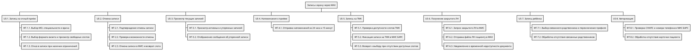

# Документ функциональных требований

Вариант: 02-Запись к врачу
Команда:  Лухава Диана, Разумовская Мария
Источник: `Документ пользовательских требований.md`
Дата: 21.11.2026

## 1. Декомпозиция


| История                                            | Функциональные требования                                                                                                                                                                                                                                                                                                                                                                                                                                                                                                                                                          |
| --------------------------------------------------------- | ---------------------------------------------------------------------------------------------------------------------------------------------------------------------------------------------------------------------------------------------------------------------------------------------------------------------------------------------------------------------------------------------------------------------------------------------------------------------------------------------------------------------------------------------------------------------------------------------------------- |
| US-1.<br />З<br />апись на очный приём  | ФТ-1.1: Система должна предлагать пациенту выбрать МО, специальность и врача. <br /><br /><br /><br />ФТ-1.2 Система должна предлагать выбрать формат визита до выбора слота и показывать свободные слоты.<br /><br /><br /><br /> ФТ-1.3: Система должна отказывать в записи при дублирующей активной записи, отсутствии прикрепления или занятом слоте. |
| US-2. Отмена записи                           | ФТ-2.1: Система должна запрашивать у пациента 2 подтверждения отмены. ФТ-2.2: Система должна запрещать отмену, если до начала приема менее 30 минут или прием уже оказан. ФТ-2.3: Система должна анулировтаь запись в МИС и возвращать слот в расписание через 30 минут.                                                                                                                          |
| US-3.<br />Просмотр текущих записей | ФТ-3.1: Система должна показывать список активных и утерянных записей с датой, временем врачом и МО.<br /> ФТ-3.2: Система должна помечать утерянную запись сообщением "Запись была утерена. Необходимо перезаписаться на прием".                                                                                                                                                                                           |
| US-4.<br />Напоминания о приёме         | ФТ-4.1: Система должна по расписанию отправлять напоминание в MAX за 24 часа и за 15 минут до приема, указывая дату, время и врача                                                                                                                                                                                                                                                                                                                                                                           |
| US-5. Запись на ТМК                            | ФТ-5.1: Система должна проверять доступность слотов ТМК после выбора формата ТМК. ФТ-5.2: Система должна фиксировать запись на ТМК в МИС БАРС. ФТ-5.3: Система должна возвращать пациента к выбору, если у врача нет слотов ТМК или слот занят.                                                                                                                                                                   |
| US-6<br />. Закрытие ЛН                         | ФТ-6.1: Система должна принимать запрос пациента на получение закрытого ЛН и запрашивать документ в МИС. ФТ-6.2: Система должна предоставлять пациенту файл закрытого ЛН в MAX. ФТ-6.3: При ошибке получения документа система должна уведомлять пациента о временной недоступности документа.                                                                      |
| US-7.<br /><br />Запись ребёнка              | ФТ-7.1: Система должна показывать список связанных родственников кнопками и переключать бот на выбранный профиль. ФТ-7.2: Система должна блокировать переключение и показывать ошибку, если связей нет.                                                                                                                                                                                                                                  |
| US-8.<br />Авторизация                         | ФТ-8.1: Система должна запрашивать СНИЛС и номер телефона и проверять их в МИС БАРС. ФТ-8.2: Система должна показывать номер техподдержки и блокировать меню, если карточка пациента не найдена.                                                                                                                                                                                                                                                   |

## 2. Спецификация функций

### ФТ-1.1

- Формулировка: Система должна предлагать пациенту выбрать МО, специальность и врача
- История-источник: US-1
- Актор: Пациент
- Вход: команда "Записаться к врачу", выбранные МО, специальность и врач
- Результат: бот по очереди показывает списки МО, специальностей и врачей, выбор пациента сохраняется для следующего шага
- Ошибочный вход: пациент не авторизован, бот не начинает запись и предлагает авторизоваться
- Приоритет MoSCoW: Must
- Обоснование приоритета: без выбора МО, специальности и врача запись невозможна

```text
Given: пациент авторизован в чат-боте MAX
When: пациент выбирает "Записаться к врачу", затем МО, специальность и врача
Then: бот сохраняет выбор и переходит к выбору формата визита
```

### ФТ-1.2

- Формулировка: Система должна предлагать выбрать формат визита до выбора слота и показывать свободные слоты.
- История-источник: US-1
- Актор: Пациент
- Вход: выбранный врач, формат визита Очный визит, слот
- Результат: бот показывает свободные слоты выбранного врача (ближайшие первыми), выбранный слот сохраняется
- Ошибочный вход: пациент выбирает формат ТМК, бот передаёт поток в сценарий записи на ТМК
- Приоритет MoSCoW: Must
- Обоснование приоритета: без слота и формата визита запись не оформить

```text
Given: пациент выбрал МО, специальность и врача
When: пациент выбирает формат "Очный визит" и свободный слот
Then: бот сохраняет слот и переходит к оформлению записи
```

### ФТ-1.3

- Формулировка: Система должна отказывать в записи при дублирующей активной записи, отсутствии прикрепления или занятом слоте
- История-источник: US-1
- Актор: Пациент
- Вход:
- Результат:
- Ошибочный вход:
- Приоритет MoSCoW:
- Обоснование приоритета:

```text
Given:
When:
Then:
```

## 3. Схема декомпозиции

Исходник: `diagrams/decomposition.puml`. Идентификаторы на схеме те же, что в разделе 2.


```plantuml

@startwbs
* Запись к врачу через MAX
** US-1. Запись на очный приём
*** ФТ-1.1. Выбор МО, специальности и врача
*** ФТ-1.2. Выбор формата визита и просмотр свободных слотов
*** ФТ-1.3. Отказ в записи при наличии ограничений
** US-2. Отмена записи
*** ФТ-2.1. Подтверждение отмены записи
*** ФТ-2.2. Проверка возможности отмены
*** ФТ-2.3. Отмена записи в МИС и возврат слота
** US-3. Просмотр текущих записей
*** ФТ-3.1. Просмотр активных и утерянных записей
*** ФТ-3.2. Отображение сообщения об утерянной записи
** US-4. Напоминания о приёме
*** ФТ-4.1. Отправка напоминаний за 24 часа и 15 минут
** US-5. Запись на ТМК
*** ФТ-5.1. Проверка доступности слотов ТМК
*** ФТ-5.2. Фиксация записи на ТМК в МИС БАРС
*** ФТ-5.3. Возврат к выбору при отсутствии доступных слотов
** US-6. Получение закрытого ЛН
*** ФТ-6.1. Запрос закрытого ЛН в МИС
*** ФТ-6.2. Отправка файла ЛН пациенту в MAX
*** ФТ-6.3. Уведомление о временной недоступности документа
** US-7. Запись ребёнка
*** ФТ-7.1. Выбор связанного родственника и переключение профиля
*** ФТ-7.2. Обработка отсутствия связанных родственников
** US-8. Авторизация
*** ФТ-8.1. Проверка СНИЛС и номера телефона в МИС БАРС
*** ФТ-8.2. Обработка отсутствия карточки пациента
@endwbs

```

## 4. Оценки сложности


| ID       | Тип (EI, EO, EQ, ILF, EIF) | Сложность и почему | Функциональные точки | Карты покера | Пользовательские поинты | Что раздувает оценку |
| -------- | ----------------------------- | ---------------------------------- | --------------------------------------- | ----------------------- | --------------------------------------------- | -------------------------------------- |
| ФТ-1.1 |                               |                                    |                                         |                         |                                               |                                        |

Сумма функциональных точек:
Сумма пользовательских поинтов:

Внутренние и внешние группы данных, посчитанные один раз:


| Группа данных | ILF или EIF | Сложность | Точки | Какие функции её используют |
| ------------------------- | -------------- | ------------------ | ---------- | --------------------------------------------------- |
|                           |                |                    |            |                                                     |

## 5. Матрица трассировки

Колонка нефункциональных требований заполняется в лабораторной работе 4.


| ID | Тип                           | Источник | Связанные ФТ | Приоритет | Критерий приёмки | FP | Поинты |
| -- | -------------------------------- | ---------------- | ----------------------- | ------------------ | ------------------------------- | -- | ------------ |
|    | Пользовательское |                  |                         |                    |                                 |    |              |

## 6. Выводы

Какие функции дают основной объём в точках. Какие функции дороги в поинтах при небольшом объёме данных. Что из этого команда берёт в ближайший выпуск.
