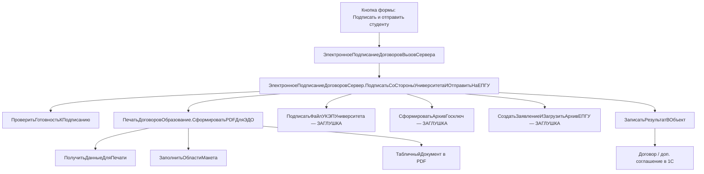

# Архитектура печатных форм и отправки на подпись

ИТ-отдел. Контур живёт **внутри 1С:Университет ПРОФ**: макет → табличный документ → PDF → УКЭП университета → заявление на ЕПГУ → «Госключ» второй стороне → файлы обратно в объект договора.

Спецификация канала: `Specifikaciya_API_EPGU_Otpravka_dokumentov_na_podpis_v_Gosklyuch_v1.8.docx` в папке варианта.

## Модули

| Модуль | Клиент / сервер | Роль |
|--------|-----------------|------|
| `ПечатьДоговоровОбразование` | сервер | команды печати, заполнение макета, выгрузка PDF |
| `ЭлектронноеПодписаниеДоговоровСервер` | сервер | кнопка «Подписать и отправить студенту»: УКЭП вуза + ЕПГУ |
| `ЭлектронноеПодписаниеДоговоровВызовСервера` | вызов сервера | тонкая обёртка для команды формы |
| Форма элемента договора / доп. соглашения | клиент | команда кнопки |

Печатные формы договора и доп. соглашения идут **через один модуль**. Меняется только имя макета и состав областей.



## Функции `ПечатьДоговоровОбразование`

Типовой контур БСП «Печать». Кнопка «Печать» на форме договора вызывает `Печать`; электронный контур вызывает `СформироватьPDFДляЭДО`, чтобы не расходились бумажный и электронный экземпляры.

| Функция | Что делает |
|---------|------------|
| `ДобавитьКомандыПечати` | в список команд: «Договор на оказание образовательных услуг», «Дополнительное соглашение» |
| `Печать` | разбор коллекции печатных форм, вызов нужного сформирователя |
| `СформироватьПечатнуюФормуДоговора` | макет договора, области шапки, сторон, предмета, графика, подписей |
| `СформироватьПечатнуюФормуДопСоглашения` | макет доп. соглашения; тянет реквизиты родительского договора |
| `ПолучитьДанныеДляПечати` | запрос по ссылке: шапка, стороны, план, стоимость, график |
| `ЗаполнитьОбластиМакета` | подстановка параметров в области макета |
| `ВывестиРеквизитыСторон` | блоки «Университет» / «Обучающийся» / «Плательщик» |
| `ВывестиГрафикПлатежей` | табличная часть графика |
| `СформироватьPDFДляЭДО` | тот же макет, что и для печати, сохранение в PDF для ЕПГУ |

Имена файлов для ЕПГУ: латиница, подчёркивание, пробел; длина с расширением не больше 50 символов. Пример: `dogovor_obuchenie.pdf`.

## Функции `ЭлектронноеПодписаниеДоговоровСервер`

| Функция | Реализация | Назначение |
|---------|------------|------------|
| `ПодписатьСоСтороныУниверситетаИОтправитьНаЕПГУ` | **точка входа кнопки** | полный сценарий |
| `ПроверитьГотовностьКПодписанию` | рабочая | договор утверждён, есть СНИЛС / OID, шаблон заполнен |
| `ПолучитьСсылкуПечатногоОбъекта` | рабочая | договор или доп. соглашение |
| `ПодписатьФайлУКЭПУниверситета` | **заглушка** | отсоединённый PKCS#7 к PDF и к `req.xml` |
| `СформироватьФайлЗаявленияReqXml` | **заглушка** | `req.xml` по XSD Госключа |
| `СформироватьАрхивГосключ` | **заглушка** | zip: `req.xml`, PDF, `*.sig`; без вложенных папок |
| `СоздатьЗаявлениеЕПГУ` | **заглушка** | `POST api/gusmev/order` |
| `ЗагрузитьАрхивЕПГУ` | **заглушка** | `POST api/gusmev/push` |
| `ЗаписатьРезультатВОбъект` | рабочая по полям, без вызова ЕПГУ | `СостояниеЭП`, `orderId`, файлы, даты |

Заглушки **не вызывают** продуктив ЕПГУ и **не подписывают** реальным сертификатом: фиксируют намерение, пишут в журнал и возвращают тестовые идентификаторы, чтобы аналитики и разработчики видели цепочку до появления боевых ключей и API-Key.

## Команда формы

На форме элемента договора и доп. соглашения одна команда:

```
ПодписатьИОтправитьСтуденту
```

Подпись: «Подписать со стороны университета и отправить студенту».  
Обработчик клиента вызывает `ЭлектронноеПодписаниеДоговоровВызовСервера.ПодписатьСоСтороныУниверситетаИОтправитьНаЕПГУ(Объект.Ссылка)`.

## Ограничения канала ЕПГУ (из спецификации v1.8)

- один получатель — физическое лицо;
- PDF (для договора — основной формат);
- не больше 15 файлов и 100 МБ на заявление;
- каждый файл в архиве сопровождается отсоединённой подписью `.sig`;
- `ServiceCode` = `10000000374`;
- получатель: СНИЛС или OID ЕСИА;
- срок подписания в «Госключ» — не больше 24 часов с отправки (`SignExpiration`).
